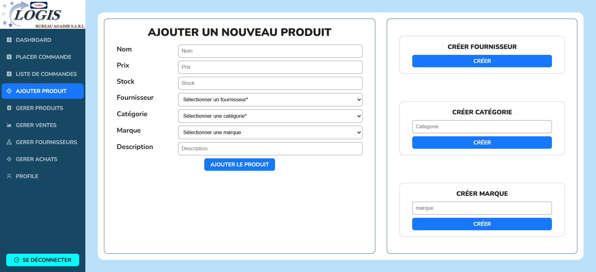
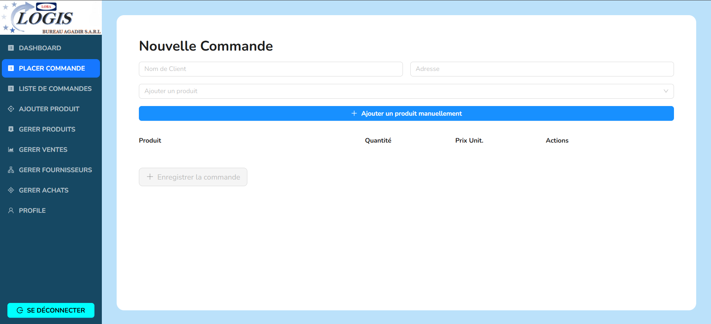
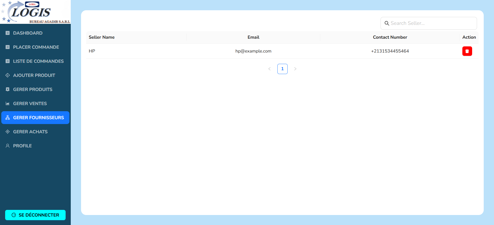
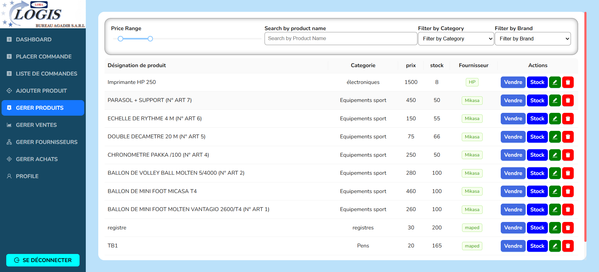
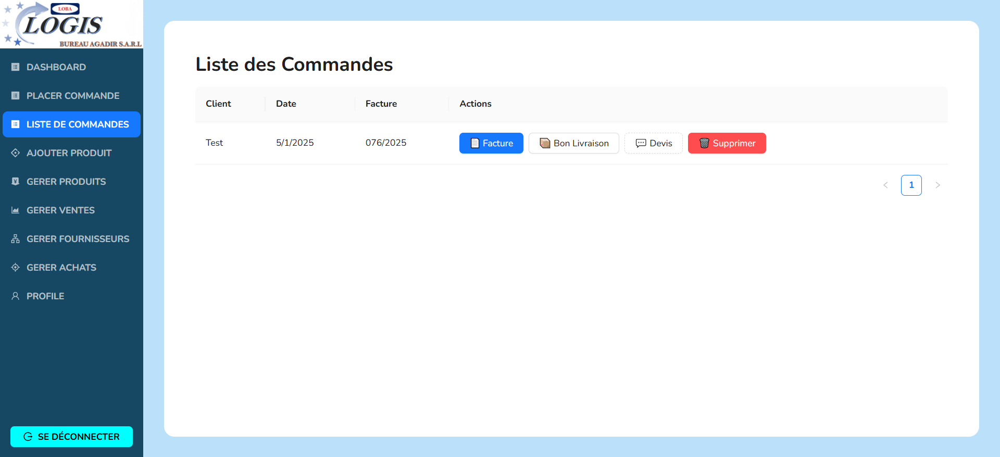
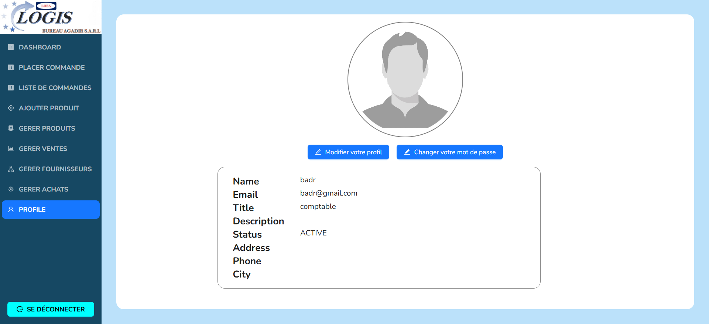

# Un système de gestion d'inventaire et commandes full stack

### Technologies

- **_Backend:_** TypeScript, Node.js, express.js, mongoDB, mongoose, zod
- **_Frontend:_** TypeScript, React, Redux-toolkit, Ant-design, zod, recharts, react-hook-form, sweetalert2, react-router-dom

# Features

1. Authentication - Créer un nouveau compte et se connecter à un compte existant

2. Gestion du profil
   - Modifier et mettre à jour sa page de profil
   - Changer son mot de passe

3. Création -
   - Ajouter une commande et l'enregistrer pour l'imprimer
   - Ajouter un nouveau produit avec diverses informations
   - Créer un vendeur
   - Créer une catégorie de produit
   - Créer une marque de produit

4. Gestion des produits -
   - Voir tous les produits de l'utilisateur connecté
   - Filtrer et rechercher avec différents champs
   - Pagination
   - Mettre à jour un produit existant
   - Supprimer un produit existant
   - Créer une nouvelle variante d'un produit
   - Vendre un produit

5. Gestion des ventes -
   - Voir toutes les ventes avec pagination
   - Mettre à jour les données de vente
   - Supprimer des données de vente

6. Gestion des vendeurs -
   - Voir tous les vendeurs avec pagination
   - Mettre à jour les données d'un vendeur
   - Supprimer un vendeur

7. Gestion des achats -
   - Voir tous les achats avec pagination
   - Mettre à jour les données d'achat
   - Supprimer des données d'achat

8. Historique des ventes

# Pages

